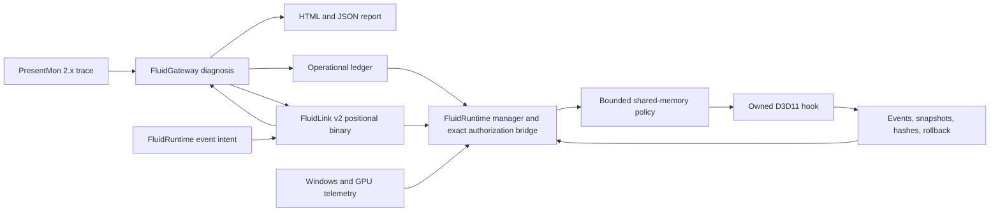

<div align="center">


# FluidGateway

**An evidence-driven gateway for finding and reducing wasted work across CPU,
GPU, RAM, VRAM, graphics resources, and frame presentation.**

*The future of performance is not only more power. It is less waste.*

[](https://github.com/maxhuntert1414-max/FluidGateway/actions/workflows/ci.yml)
[](pyproject.toml)
[](LICENSE)
[](https://github.com/maxhuntert1414-max/FluidRuntime/releases/tag/v0.15.0)

[Quick Start](#quick-start) | [Evidence](#measured-actuation) |
[Architecture](#architecture) | [Roadmap](#roadmap) |
[Contributing](CONTRIBUTING.md)

</div>

## Why FluidGateway

Traditional PCs cannot reproduce physically unified memory through software.
They can still waste less.

FluidGateway explores how early, evidence-based decisions can reduce redundant
copies, late synchronization, buffer churn, unnecessary memory transit, and
poor frame-pipeline coordination. The project deliberately separates diagnosis,
policy, observation, and actuation so each layer can be tested and rolled back.

The public promise today is precise:

> Find probable waste in the frame path, turn it into structured policy, and
> prove narrowly scoped interventions before expanding their authority.

## Project At A Glance

| Component | Role | Current state |
| --- | --- | --- |
| **FluidGateway v0.64.0** | PresentMon analysis, policy modeling, FluidLink decisions, operational ledger | Usable diagnostic CLI; advisory by default, with one exact owned-lab authorization consumed by Runtime v0.15 |
| **[FluidRuntime v0.15.0](https://github.com/maxhuntert1414-max/FluidRuntime)** | Windows/GPU telemetry, FluidLink client, cooperative D3D11 hook, managed-to-native control | First fail-closed live Gateway-to-hook loop plus bounded owned-target actuation |
| External game integration | Allowlisted observation and future reversible control | Not implemented |
| CPU scheduler and RAM/VRAM residency backends | Deeper system-level efficiency management | Research roadmap |

## See It Working

The report below was generated directly from the bundled PresentMon fixture. It
ranks probable waste, shows numerical evidence, assigns confidence, and proposes
technical next steps without pretending that inference is internal-cause proof.


## Capabilities Today

| Capability | Output | Authority |
| --- | --- | --- |
| Tolerant PresentMon 2.x ingestion | Parsed frame samples despite `NA`, missing columns, and legacy names | Read-only |
| Ranked waste diagnosis | HTML and JSON findings with severity, confidence, percentiles, and evidence | Read-only |
| Advisory management planning | CPU/GPU handoff, pacing, queue, presentation, and memory recommendations | Dry run |
| Trace tracking | Local history with SHA-256 identity, labels, findings, and policy pressure | Local data only |
| Pipeline optimizer prototype | Removes redundant modeled copies/syncs and reuses modeled transient buffers | Simulation |
| Runtime event protocol | JSONL replay, TCP decision server, lifecycle adapter, persisted manager state | Local prototype |
| FluidLink v2 intercommunication | Positional binary payloads, numeric opcodes, integer microseconds/bytes, exact contract and 17 full-frame golden vectors | Local advisory IPC |
| Gateway-authorized direct update | 64 live duplicate-upload decisions become one action-8 budget; native generation and `memcmp` remain final | Owned target only |
| PresentMon-to-daemon bridge | Operational ledger and repeated advisory control cycles | Dry run |
| Native copy-path intervention | Bounded D3D11 copy elision through FluidRuntime | Owned target only |
| Native readback intervention | Bounded `DEFAULT -> STAGING + CPU_READ` elision through FluidRuntime | Owned target only |
| Native upload intervention | Bounded `STAGING + CPU_WRITE -> DEFAULT` elision through FluidRuntime | Owned target only |
| Native direct-update intervention | Exact-content full-buffer `UpdateSubresource` elision through FluidRuntime | Owned target only |

FluidGateway has no third-party runtime dependencies. The Python v0.64.0 suite
currently contains 242 tests and runs on Python 3.10 and 3.13 in GitHub Actions.

## Measured Actuation

FluidRuntime v0.12.0 adds a fourth isolated action: exact-content elimination
of repeated full-buffer `UpdateSubresource` uploads. This is a more direct
CPU-memory-to-D3D11 path than the v0.11 staging-copy experiment.

The owned workload deliberately contains three required uploads: content A,
content B after a one-bit mutation, and B again after another API overwrites the
destination with content C. Only the remaining 64 exact repeats may be skipped.

On an AMD Radeon RX 580:

| Signal | Baseline | Optimized |
| --- | ---: | ---: |
| Direct 4 MiB updates observed | 67 | 67 |
| Direct updates forwarded | 67 | 3 |
| Exact redundant updates skipped | 0 | 64 |
| Exact-content cache | 1 resource / 4 MiB | 1 resource / 4 MiB |
| Logical source bytes avoided | 0 | 268,435,456 bytes |
| CPU workload p95 | 333.515 ms | 89.122 ms |
| GPU timestamp interval p95 | 275.277 ms | 3.213 ms |
| Measured CPU pair wins | 0/10 | 10/10 |
| Measured GPU pair wins | 0/10 | 10/10 |

`memcmp` proves equality; hashes only label evidence. Every run verifies the
A-to-B mutation, invalidation after the C write, exact final B readback, policy
accounting, adapter identity, event/snapshot agreement, zero ring loss, and
restored dispatch. The 320-process Release/Debug negative matrix also passed.

This is deliberately scoped to
`owned-d3d11-default-buffer-full-update-subresource-exact-content-workload-only`.
It is not evidence of physical RAM-to-VRAM or PCIe bytes, game FPS, lower power,
texture/partial uploads, external-game safety, or a general-purpose cache. The
GPU number is a guarded workload interval, not a GPU-busy counter.

[Read the v0.12 evidence and raw traces](https://github.com/maxhuntert1414-max/FluidRuntime/blob/v0.12.0/docs/evidence/v0.12.0-update-upload-elision.md)

FluidRuntime v0.15.0 now drives that same action from a live FluidGateway 0.64.0
session. Each optimized run requires one executed seed and 64 exact
`deduplicate-identical-transfer` decisions before the optimized target starts.
The Runtime then publishes action bit 8 with budget 64; the hook can spend it
only after destination-generation and full-content equality checks.

The RX 580 gate passed 22/22 raw runs and all ten measured native workload pairs
favored the optimized path. Three adversarial peers also passed: malformed
binary response, accepted TCP connection with no response, and a valid peer
whose individually short delays exceeded the single 500 ms authorization
deadline. All produced a fresh baseline with 70 forwarded calls, zero skips,
and no policy publication.

Runtime binds the exact IPv4 loopback tuple through the Windows TCP owner table
to the expected Gateway PID and executable SHA-256. It also holds target/hook
binaries without write/delete sharing, revalidates what the target loaded, and
binds the authorization to a unique context SHA-256. This is OS process binding,
not cryptographic authentication of a hostile or compromised peer.

This is the first functional Gateway-to-hook closed loop, not a production
per-frame scheduler. Authorization currently uses 74 serial round trips per
optimized run and is outside the native timing interval, so the v0.15 report
always blocks end-to-end performance claims.

[Read the v0.15 closed-loop evidence and raw traces](https://github.com/maxhuntert1414-max/FluidRuntime/blob/v0.15.0/docs/evidence/v0.15.0-gateway-managed-update-upload.md)

## Architecture



The current native arrow is cooperative and opt-in. It does not represent
remote injection, a driver hook, or authorization to touch protected software.

## Quick Start

Requirements: Python 3.10 or newer. The diagnostic CLI uses only the standard
library.

```powershell
git clone https://github.com/maxhuntert1414-max/FluidGateway.git
cd FluidGateway

python -m unittest
python -m fluidgateway analyze `
  --presentmon tests/fixtures/copy_present.csv `
  --out tmp/report.html
```

The analysis writes:

- `tmp/report.html`: visual diagnostic report;
- `tmp/report.json`: the same evidence as structured data.

Generate an advisory management plan:

```powershell
python -m fluidgateway manage `
  --presentmon tests/fixtures/gpu_wait.csv `
  --out tmp/management.json
```

Run the persistent PresentMon-to-manager dry-run bridge:

```powershell
python -m fluidgateway runtime run-presentmon-daemon `
  --presentmon tests/fixtures/gpu_wait.csv `
  --events-out tmp/presentmon-events.jsonl `
  --state tmp/runtime-state.json `
  --out tmp/runtime-daemon.json
```

Use `python -m fluidgateway --help` and
`python -m fluidgateway runtime --help` for the complete command surface.

Run the local FluidLink decision endpoint:

```powershell
python -m fluidgateway runtime serve-events `
  --host 127.0.0.1 `
  --port 8765
```

FluidRuntime v0.15 provides the typed .NET client and a cross-process v1/v2
probe. FluidLink v2 keeps the fixed binary control header and replaces the JSON
body with opcode-specific positional fields, capability bitmasks, and integer
microsecond/byte units. The measured same-flow result is 3,189 v1 frame bytes
versus 1,880 v2 frame bytes, a 41.05% reduction. The handshake verifies the
exact contract fingerprint, while the client serializes correlated round trips
and fails closed on malformed or truncated frames. FluidLink v1 and raw JSONL
remain isolated compatibility modes. Read the [FluidLink v2 contract](docs/fluidlink-v2.md)
for schemas, byte evidence, deferrals, and trust boundaries.

The dedicated v0.15 update-upload bridge is narrower than the generic protocol:
it requires an OS-verified expected peer process, frozen target/hook evidence,
exact contract/capabilities, a context digest, and exact decision counts, then
hands only a bounded candidate budget to the owned native hook. Advertised
server identity is metadata. Gateway size/source/target deduplication is not
content proof; native `memcmp` remains authoritative.

## Findings

The diagnostic engine looks for:

- suspicious copy/GDI presentation paths;
- excessive display and render-present latency;
- CPU wait and time spent inside `Present()`;
- GPU bubbles or underfeeding;
- unstable frame pacing;
- frames that appear not to reach display;
- composition-related waste.

Missing columns reduce confidence instead of fabricating zeros. Every finding is
an inference supported by numerical evidence, not proof of a hidden engine or
driver cause.

## Design Principles

1. **Evidence before authority.** Observation and equivalence gates come before
   actuation.
2. **Fail closed.** Missing identity, timing, provenance, or rollback evidence
   blocks the claim or action.
3. **Bounded intervention.** Policies have explicit lifetime, scope, budget, and
   target opt-in.
4. **Reversible by construction.** Dispatch and policy authority must return to
   a known state.
5. **Claims match measurements.** GPU workload, CPU time, frame time, FPS, and
   power are different claims.
6. **No anti-cheat bypass.** Protected targets and covert injection are outside
   the project boundary.

## Roadmap

- [x] PresentMon diagnostics with ranked HTML/JSON evidence.
- [x] Advisory CPU/GPU/RAM/VRAM policy and persistent daemon contracts.
- [x] Cooperative D3D11 observation with shared-memory telemetry.
- [x] Bounded managed-to-native copy elision with hardware evidence.
- [x] Direction-specific D3D11 readback elision with per-map equivalence and
  hardware evidence.
- [x] Prototype the API-visible `RAM -> GPU` upload direction in the owned lab.
- [x] Add bounded exact-content full-buffer `UpdateSubresource` elision with
  mutation and external-write generation guards.
- [x] Add a versioned FluidGateway/FluidRuntime intercommunication library with
  binary framing, numeric opcodes, compact decisions, negotiated contract
  fingerprints, and cross-process CI.
- [x] Remove JSON from FluidLink v2 payloads and use positional schemas,
  capability bitmasks, fixed-point wire units, and cross-language golden vectors.
- [x] Connect one exact set of live FluidGateway decisions to a bounded native
  action with malformed-response, real-timeout, content, and rollback gates.
- [ ] Batch the 64 candidate decisions into a bounded low-latency control shape
  and measure authorization inside the complete end-to-end interval.
- [ ] Extend upload provenance to dynamic buffers, textures, pitch-aware and
  partial regions, `UpdateSubresource1`, reuse, batching, fences, and
  synchronization.
- [ ] Harden provenance for aliases, shader writes, fences, deferred contexts,
  and synchronization.
- [ ] Add explicit allowlisted external observation for authorized,
  unprotected software.
- [ ] Generalize live policies beyond the single owned direct-update action only
  after each path passes provenance, regression, and rollback gates.
- [ ] Build separate CPU scheduling and RAM/VRAM residency backends.
- [ ] Build an owned D3D12 observation backend, then prove a separately bounded
  action with D3D12-specific resource-state, queue, fence, and rollback rules.
- [ ] Build a separate opt-in Vulkan layer afterward, with explicit memory,
  layout, queue-family, semaphore/fence, validation, and rollback evidence.

The ambition is large, but promotion is intentionally incremental: owned lab,
reproducible evidence, narrow claim, then the next layer of authority.

## Repository Map

- [`fluidgateway/`](fluidgateway): Python diagnostic, policy, control, and daemon
  implementation.
- [`contracts/fluidlink-v1.contract.json`](contracts/fluidlink-v1.contract.json):
  compatible v1 header and bounded JSON-body contract.
- [`contracts/fluidlink-v2.contract.json`](contracts/fluidlink-v2.contract.json):
  preferred positional binary schema, limits, masks, units, and opcode registry.
- [`contracts/fluidlink-v2.golden.json`](contracts/fluidlink-v2.golden.json):
  17 canonical Python/.NET full-frame interoperability vectors.
- [`docs/fluidlink-v2.md`](docs/fluidlink-v2.md): wire schemas, same-flow byte
  evidence, compatibility, deferrals, and trust boundary.
- [`tests/`](tests): 242 unit and integration tests plus deterministic fixtures.
- [`docs/technical-reference.md`](docs/technical-reference.md): complete v0.64
  protocol and feature history preserved from the original long-form README.
- [`FluidRuntime`](https://github.com/maxhuntert1414-max/FluidRuntime): native
  observation, actuation, evidence, and rollback companion.
- [`FluidRuntime v0.15.0 evidence`](https://github.com/maxhuntert1414-max/FluidRuntime/blob/v0.15.0/docs/evidence/v0.15.0-gateway-managed-update-upload.md): live authorization, exact-content policy, fail-closed controls, WARP, and RX 580 results.

## Contributing

Contributions are welcome in diagnostics, trace compatibility, conservative
heuristics, telemetry adapters, provenance research, reproducible workloads,
documentation, and tests. Start with [CONTRIBUTING.md](CONTRIBUTING.md), follow
the [Code of Conduct](CODE_OF_CONDUCT.md), and report vulnerabilities according
to [SECURITY.md](SECURITY.md).

## License

FluidGateway is open source under the [MIT License](LICENSE).
