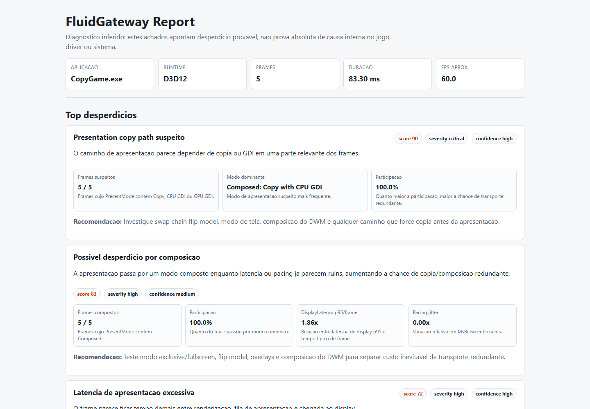
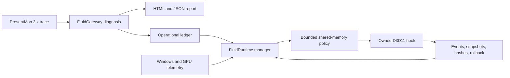

<div align="center">

# FluidGateway

**An evidence-driven gateway for finding and reducing wasted work across CPU,
GPU, RAM, VRAM, graphics resources, and frame presentation.**

*The future of performance is not only more power. It is less waste.*

[](https://github.com/maxhuntert1414-max/FluidGateway/actions/workflows/ci.yml)
[](pyproject.toml)
[](LICENSE)
[](https://github.com/maxhuntert1414-max/FluidRuntime/releases/tag/v0.9.0)

[Quick Start](#quick-start) | [Evidence](#measured-actuation) |
[Architecture](#architecture) | [Roadmap](#roadmap) |
[Contributing](CONTRIBUTING.md)

</div>

## Why FluidGateway

Traditional PCs cannot reproduce physically unified memory through software.
They can still waste less.

FluidGateway explores how early, evidence-based decisions can reduce redundant
copies, late synchronization, buffer churn, unnecessary memory transit, and
poor frame-pipeline coordination. The project deliberately separates diagnosis,
policy, observation, and actuation so each layer can be tested and rolled back.

The public promise today is precise:

> Find probable waste in the frame path, turn it into structured policy, and
> prove narrowly scoped interventions before expanding their authority.

## Project At A Glance

| Component | Role | Current state |
| --- | --- | --- |
| **FluidGateway v0.62.0** | PresentMon analysis, policy modeling, runtime protocols, operational ledger | Usable diagnostic CLI; management remains advisory |
| **[FluidRuntime v0.9.0](https://github.com/maxhuntert1414-max/FluidRuntime)** | Windows/GPU telemetry, cooperative D3D11 hook, managed-to-native control | Controlled actuation proven in an owned, opt-in laboratory |
| External game integration | Allowlisted observation and future reversible control | Not implemented |
| CPU scheduler and RAM/VRAM residency backends | Deeper system-level efficiency management | Research roadmap |

## See It Working

The report below was generated directly from the bundled PresentMon fixture. It
ranks probable waste, shows numerical evidence, assigns confidence, and proposes
technical next steps without pretending that inference is internal-cause proof.



## Capabilities Today

| Capability | Output | Authority |
| --- | --- | --- |
| Tolerant PresentMon 2.x ingestion | Parsed frame samples despite `NA`, missing columns, and legacy names | Read-only |
| Ranked waste diagnosis | HTML and JSON findings with severity, confidence, percentiles, and evidence | Read-only |
| Advisory management planning | CPU/GPU handoff, pacing, queue, presentation, and memory recommendations | Dry run |
| Trace tracking | Local history with SHA-256 identity, labels, findings, and policy pressure | Local data only |
| Pipeline optimizer prototype | Removes redundant modeled copies/syncs and reuses modeled transient buffers | Simulation |
| Runtime event protocol | JSONL replay, TCP decision server, lifecycle adapter, persisted manager state | Local prototype |
| PresentMon-to-daemon bridge | Operational ledger and repeated advisory control cycles | Dry run |
| Native copy-path intervention | Bounded D3D11 copy elision through FluidRuntime | Owned target only |

FluidGateway has no third-party runtime dependencies. The Python v0.62.0 suite
currently contains 199 tests and runs on Python 3.10 and 3.13 in GitHub Actions.

## Measured Actuation

FluidRuntime v0.9.0 is the first release that demonstrates sustained, measurable
interference rather than only diagnosis.

In an owned D3D11 workload on an AMD Radeon RX 580:

| Signal | Baseline | Optimized |
| --- | ---: | ---: |
| Whole-resource copies observed | 135 | 135 |
| Whole-resource copies forwarded | 135 | 7 |
| Proven redundant copies skipped | 0 | 128 |
| Logical copy traffic avoided | 0 | 536,870,912 bytes |
| GPU workload p95 | 27.473 ms | 0.357 ms |
| Measured GPU pair wins | 0/10 | 10/10 |

Every measured run required exact source/destination readback hashes, complete
event and snapshot agreement, adapter identity, valid GPU timestamps, and
restored dispatch after detach. A 320-process Release/Debug policy matrix also
proved valid, rejected, expired, and no-opt-in behavior.

This is a deliberately narrow
`owned-d3d11-sustained-copy-elision-gpu-workload-only` result. CPU timing
regressed slightly, and 512 MiB of logical removed calls does not mean 512 MiB
of physical PCIe traffic. The project does **not** claim higher game FPS, lower
end-to-end frame time, lower power, or support for external games from this
experiment.

[Read the evidence and raw traces](https://github.com/maxhuntert1414-max/FluidRuntime/blob/v0.9.0/docs/evidence/v0.9.0-sustained-copy-elision.md)

## Architecture



The current native arrow is cooperative and opt-in. It does not represent
remote injection, a driver hook, or authorization to touch protected software.

## Quick Start

Requirements: Python 3.10 or newer. The diagnostic CLI uses only the standard
library.

```powershell
git clone https://github.com/maxhuntert1414-max/FluidGateway.git
cd FluidGateway

python -m unittest
python -m fluidgateway analyze `
  --presentmon tests/fixtures/copy_present.csv `
  --out tmp/report.html
```

The analysis writes:

- `tmp/report.html`: visual diagnostic report;
- `tmp/report.json`: the same evidence as structured data.

Generate an advisory management plan:

```powershell
python -m fluidgateway manage `
  --presentmon tests/fixtures/gpu_wait.csv `
  --out tmp/management.json
```

Run the persistent PresentMon-to-manager dry-run bridge:

```powershell
python -m fluidgateway runtime run-presentmon-daemon `
  --presentmon tests/fixtures/gpu_wait.csv `
  --events-out tmp/presentmon-events.jsonl `
  --state tmp/runtime-state.json `
  --out tmp/runtime-daemon.json
```

Use `python -m fluidgateway --help` and
`python -m fluidgateway runtime --help` for the complete command surface.

## Findings

The diagnostic engine looks for:

- suspicious copy/GDI presentation paths;
- excessive display and render-present latency;
- CPU wait and time spent inside `Present()`;
- GPU bubbles or underfeeding;
- unstable frame pacing;
- frames that appear not to reach display;
- composition-related waste.

Missing columns reduce confidence instead of fabricating zeros. Every finding is
an inference supported by numerical evidence, not proof of a hidden engine or
driver cause.

## Design Principles

1. **Evidence before authority.** Observation and equivalence gates come before
   actuation.
2. **Fail closed.** Missing identity, timing, provenance, or rollback evidence
   blocks the claim or action.
3. **Bounded intervention.** Policies have explicit lifetime, scope, budget, and
   target opt-in.
4. **Reversible by construction.** Dispatch and policy authority must return to
   a known state.
5. **Claims match measurements.** GPU workload, CPU time, frame time, FPS, and
   power are different claims.
6. **No anti-cheat bypass.** Protected targets and covert injection are outside
   the project boundary.

## Roadmap

- [x] PresentMon diagnostics with ranked HTML/JSON evidence.
- [x] Advisory CPU/GPU/RAM/VRAM policy and persistent daemon contracts.
- [x] Cooperative D3D11 observation with shared-memory telemetry.
- [x] Bounded managed-to-native copy elision with hardware evidence.
- [ ] Harden provenance for aliases, shader writes, fences, deferred contexts,
  and synchronization.
- [ ] Add explicit allowlisted external observation for authorized,
  unprotected software.
- [ ] Derive shadow policies from live FluidGateway evidence and promote only
  after regression/rollback gates pass.
- [ ] Build separate CPU scheduling and RAM/VRAM residency backends.
- [ ] Expand observation and control research to D3D12 and Vulkan.

The ambition is large, but promotion is intentionally incremental: owned lab,
reproducible evidence, narrow claim, then the next layer of authority.

## Repository Map

- [`fluidgateway/`](fluidgateway): Python diagnostic, policy, control, and daemon
  implementation.
- [`tests/`](tests): 199 unit and integration tests plus deterministic fixtures.
- [`docs/technical-reference.md`](docs/technical-reference.md): complete v0.62
  protocol and feature history preserved from the original long-form README.
- [`FluidRuntime`](https://github.com/maxhuntert1414-max/FluidRuntime): native
  observation, actuation, evidence, and rollback companion.
- [`FluidRuntime v0.9.0 evidence`](https://github.com/maxhuntert1414-max/FluidRuntime/blob/v0.9.0/docs/evidence/v0.9.0-sustained-copy-elision.md): raw policy,
  WARP, and RX 580 results.

## Contributing

Contributions are welcome in diagnostics, trace compatibility, conservative
heuristics, telemetry adapters, provenance research, reproducible workloads,
documentation, and tests. Start with [CONTRIBUTING.md](CONTRIBUTING.md), follow
the [Code of Conduct](CODE_OF_CONDUCT.md), and report vulnerabilities according
to [SECURITY.md](SECURITY.md).

## License

FluidGateway is open source under the [MIT License](LICENSE).
